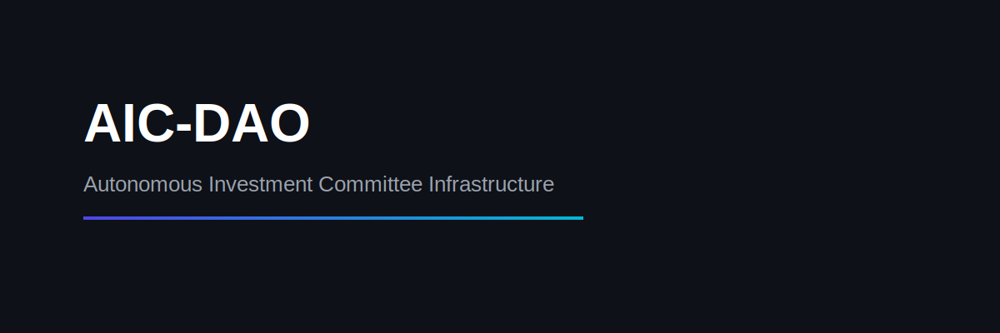

&nbsp; 

\# AIC-DAO

Autonomous Investment Committee Infrastructure  

Multi-Agent Capital Allocation Engine for Web3 Treasuries

---

\## Overview

AIC-DAO is a structured multi-agent capital decision engine designed to simulate an institutional investment committee for decentralized treasury governance.

Instead of relying on a single AI output, AIC-DAO coordinates specialized agents:

• Risk Intelligence Agent  

• Market \& Moat Evaluation Agent  

• Tokenomics \& Governance Agent  

• Structured Consensus Engine  

• Capital Allocation Modeling System  

This enables layered evaluation, structured debate, and confidence-weighted treasury deployment.

---

\## Why This Matters

DAO treasuries often deploy capital based on:

\- Emotional conviction

\- Community bias

\- Limited structured risk modeling

AIC-DAO introduces:

\- Transparent agent reasoning

\- Risk-adjusted capital modeling

\- Confidence-based allocation scoring

\- Simulated institutional governance structure

---

\## Architecture

Startup Input  

&nbsp;     ↓  

Risk Agent  

Market Agent  

Tokenomics Agent  

&nbsp;     ↓  

Consensus Engine  

&nbsp;     ↓  

Capital Allocation Model  

&nbsp;     ↓  

Treasury Simulation Dashboard  

---

\## Core Features

• Multi-agent evaluation architecture  

• Structured risk vs opportunity scoring  

• Weighted consensus confidence system  

• Treasury allocation simulation  

• Institutional-style dashboard UI  

• Portfolio exposure modeling  

---

\## Tech Stack

\- Python  

\- Streamlit  

\- Plotly  

\- OpenAI API (optional integration)  

\- Session-state portfolio tracking  

---

\## Run Locally

Install dependencies:

pip install -r requirements.txt

Launch:

streamlit run app.py

---

\## Strategic Vision

AIC-DAO explores the future of decentralized capital infrastructure —  

where autonomous agents coordinate risk, conviction, and governance at scale.

---

\## Roadmap

\- Live multi-agent streaming responses  

\- DAO voting module integration  

\- On-chain treasury connectors  

\- Agent memory persistence  

\- Capital confidence trend analytics  

---

\## License

MIT License

